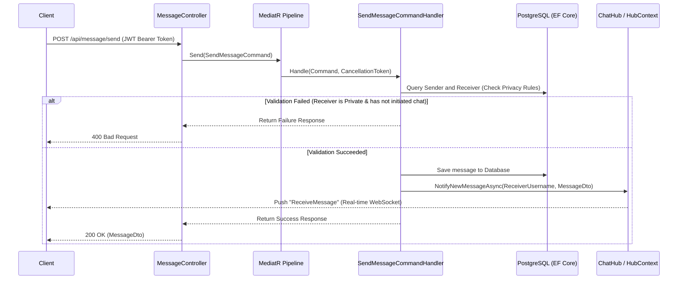

# Technical Architecture Documentation

This document describes the design decisions, component interactions, and security mechanisms of the Session-style Messaging App API.

---

## 🔄 CQRS & Request Flow

The application follows the **CQRS (Command Query Responsibility Segregation)** pattern, separating read operations (Queries) from write operations (Commands). All request pipelines are routed through **MediatR**.



### Flow Breakdown:
1. **Controller Layer**: Extracts claims (User ID and Username) from the authenticated JWT context, maps request models to MediatR Commands, and dispatches them.
2. **MediatR Pipeline**: Executes cross-cutting concerns (such as request validation and logging) before forwarding the request to the specific Handler.
3. **Handlers**: Contain pure business logic and coordinate with infrastructure services (database context, token generator, static storage, SignalR notifier).
4. **Database & Real-time Delivery**: Commits state changes to PostgreSQL and immediately fires real-time updates over WebSocket connections for online recipients.

---

## 📡 SignalR Connection & Authentication Mapping

A secure real-time messaging application must guarantee that users only receive messages intended for them. In typical ASP.NET Core SignalR setups, connections are identified by connection IDs or internal claims.

### Custom Username Mapping (`UsernameUserIdProvider`)
To bridge JWT claims and SignalR hubs:
- A custom `IUserIdProvider` is implemented:
  ```csharp
  public class UsernameUserIdProvider : IUserIdProvider
  {
      public string? GetUserId(HubConnectionContext connection)
      {
          return connection.User?.FindFirst(ClaimTypes.Name)?.Value;
      }
  }
  ```
- This configures SignalR to use the user's **unique username** (from the `ClaimTypes.Name` claim of the JWT token) as the connection identifier instead of the internal GUID.
- Messages can then be target-routed using the recipient's username:
  ```csharp
  await _hubContext.Clients.User(receiverUsername).SendAsync("ReceiveMessage", message);
  ```

---

## 🔒 Security & Mnemonic Word Generation

To prevent dependencies on email, phone numbers, or central directory databases, the system implements a seed-phrase based password recovery mechanism:

1. **Generation**: During registration, `MnemonicHelper` generates 12 cryptographically random words selected from a fixed wordlist.
2. **Hashing**: The 12-word string is normalized, space-trimmed, and hashed using **SHA-256** with a unique salt:
   ```csharp
   var phraseHash = MnemonicHelper.HashMnemonic(mnemonicString);
   ```
3. **Storage**: The hashed phrase (`RecoveryPhraseHash`) is stored in the `AspNetUsers` table. The plain text phrase is returned to the user *only once* during registration.
4. **Recovery**: If a user forgets their password, they must supply their username, the 12 recovery words in the correct order, and a new password. The API verifies the hash, generates an EF Core password reset token, and updates the user's credentials securely.

---

## 🛡️ Privacy Controls & Search Restrictions

User privacy settings are protected at both the query and command layers:

- **Search Restructuring**: The search query completely filters out users with `IsPrivate == true` using the database execution plan:
  ```csharp
  _context.Users.Where(u => !u.IsPrivate && ...)
  ```
- **Profile Obfuscation**: If a user directly requests another user's profile (`GET /api/profile/{username}`):
  - The query handler verifies if the requester is the profile owner.
  - If the account is private and the requester is not the owner, the handler intercepts the response, redacting the biography to `"[Private Profile]"` and setting metadata and profile picture fields to `null`.
- **Message Prevention**: The `SendMessageCommand` checks the message logs. If a recipient is private, the command fails unless the recipient has previously messaged the sender first (implying consent to communicate).
